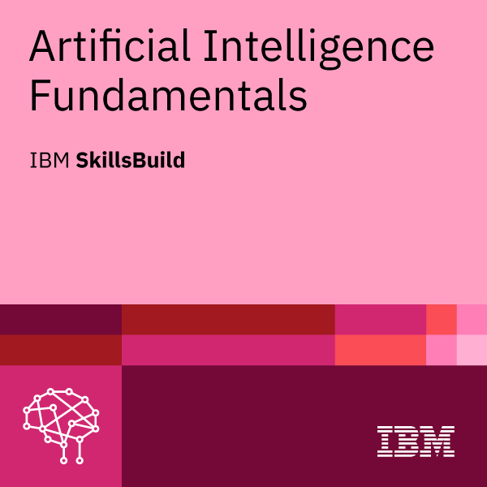
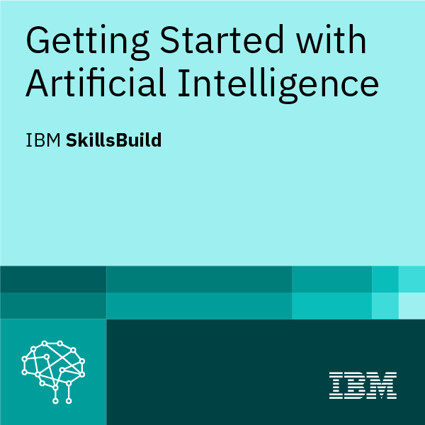
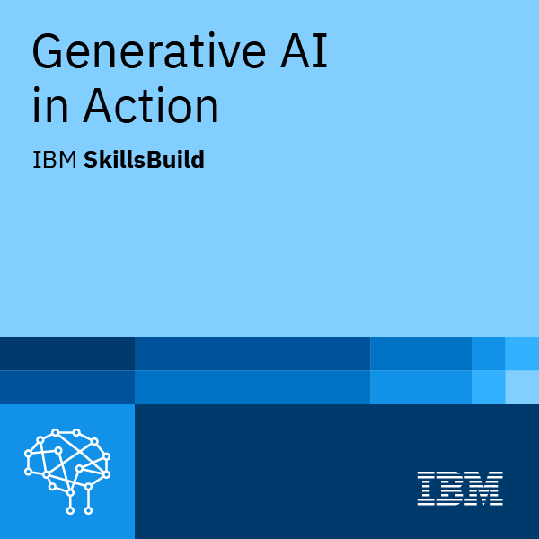

# 🤖 AI & ML Internship Portfolio – Edunet x IBM SkillsBuild

This repository showcases my learning journey and hands-on projects completed during the **AI/ML Internship Program** offered by **Edunet Foundation in collaboration with IBM SkillsBuild**.

---

## 🏆 Certifications

| Course | Badge |
|--------|-------|
| Artificial Intelligence Fundamentals |  |
| Getting Started with Artificial Intelligence |  |
| Generative AI in Action |  |

🗂️ PDF Copies:
- [`ArtificialIntelligenceFundamentals_Badge20240704-7-fnptrr.pdf`](./ArtificialIntelligenceFundamentals_Badge20240704-7-fnptrr.pdf)  
- [`GettingStartedwithArtificialIntelligence_Badge20240704-7-2hre3w.pdf`](./GettingStartedwithArtificialIntelligence_Badge20240704-7-2hre3w.pdf)  
- [`GenerativeAIinAction_Badge20240704-7-an9l6y.pdf`](./GenerativeAIinAction_Badge20240704-7-an9l6y.pdf)

---

## 📓 Notes

- [📝 Handwritten Notes – Edunet AI/ML Internship (Compressed)](./Hand%20written%20notes%20-%20Edunet%20AI%26ML%20Internship(E.Likhith)_compressed.pdf)
- [📒 IBM SkillsBuild Notes – 28+ Learning Hours](./Handwritten%20Notes%20-%20IBM%20SkillsBuild%20Platform(28+%20Learning%20Hours,%20E.Likhith).pdf)

---

## 🧠 Project: Employee Burnout Prediction

| File | Description |
|------|-------------|
| `Employee_burnout_Prediction.ipynb` | Jupyter notebook for predicting burnout using ML |
| `employee_burnout_analysis-AI.xlsx` | Supporting dataset in Excel format |

---

### 🔧 Tools & Concepts Used

- Python (Pandas, NumPy, Scikit-learn)
- Jupyter Notebook
- Data Visualization
- Logistic Regression, Decision Tree, etc.

---

## 👨‍💻 Author

**Likhith Edupuganti**

📧 [Email](mailto:likhith_edupuganti@srmap.edu.in)  
🔗 [LinkedIn](https://www.linkedin.com/in/likhithedupuganti)  
🌐 [Portfolio](https://portfoliobylikhith.netlify.app/)

---

## ⭐ Show Some Love

```bash
🌟 Star this repo
🍴 Fork if useful
📩 Contact for collaboration
